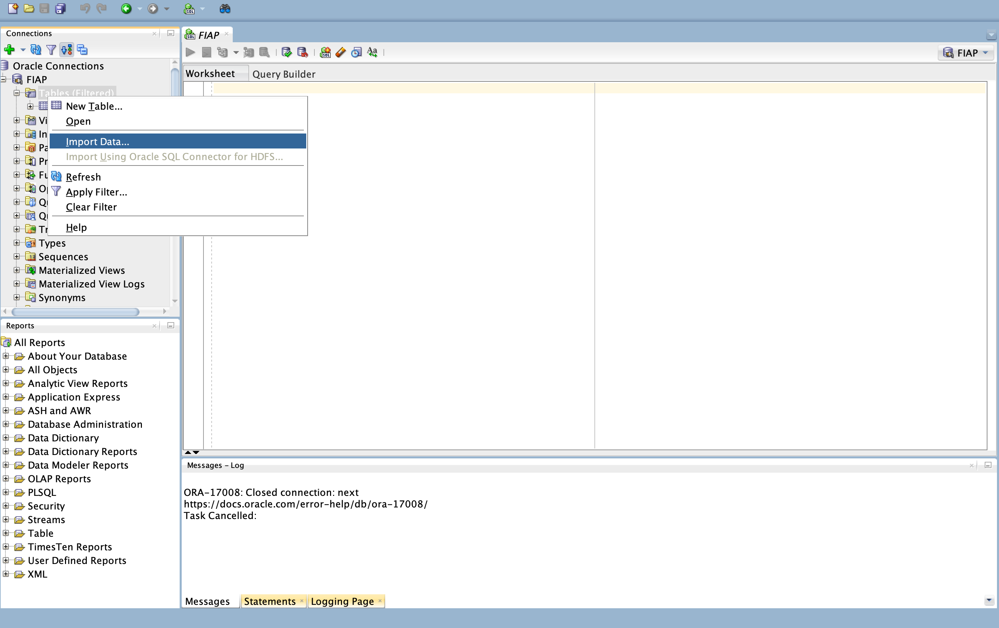
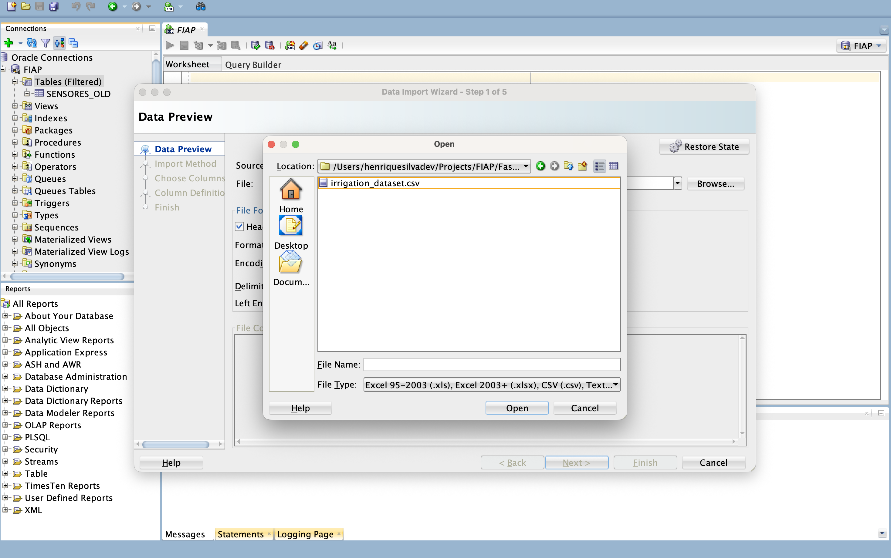
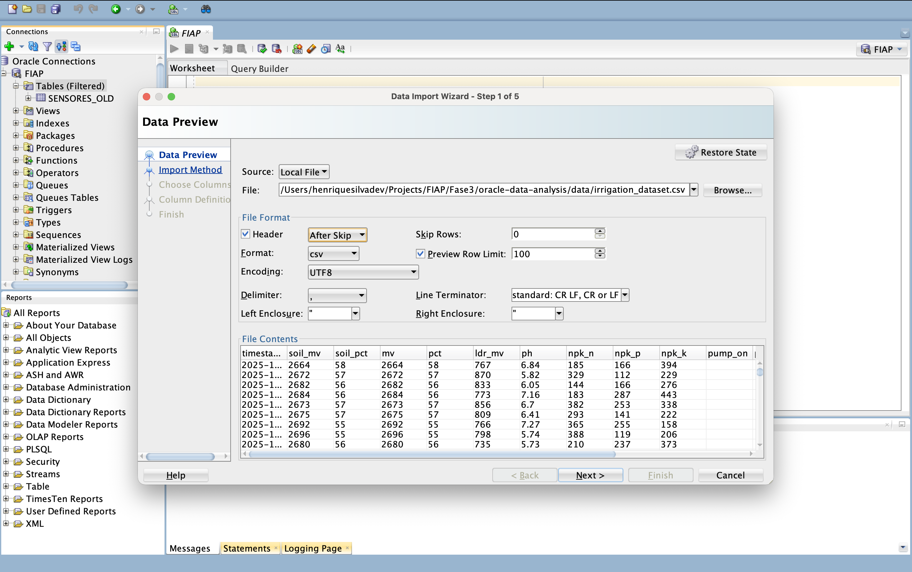
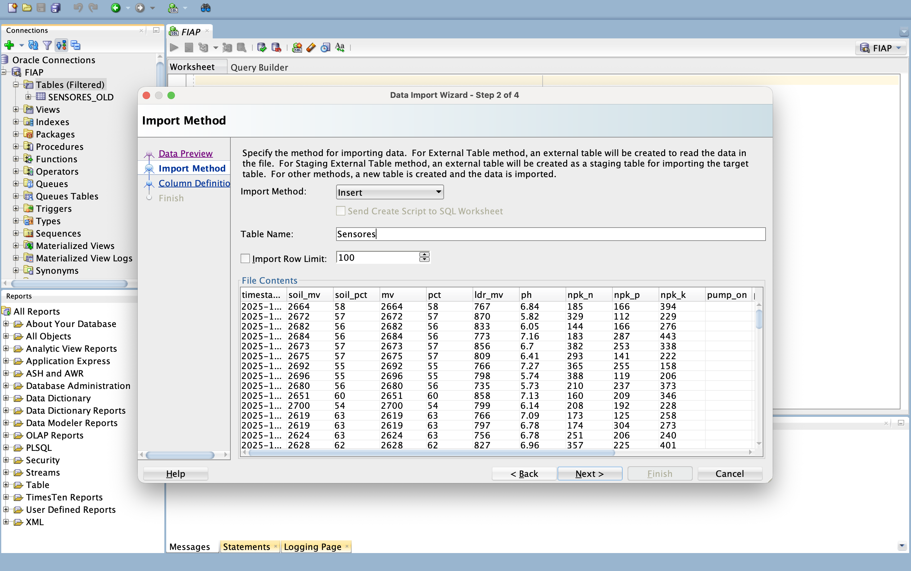
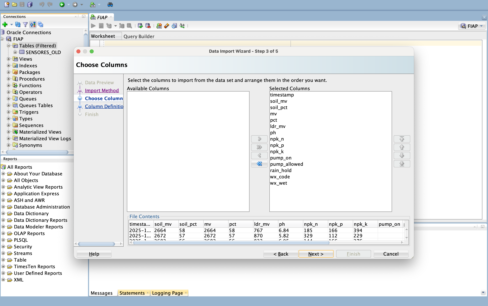
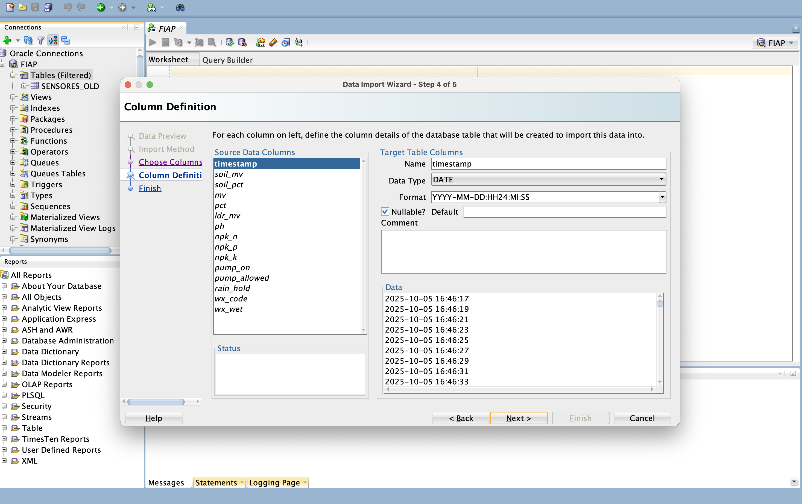
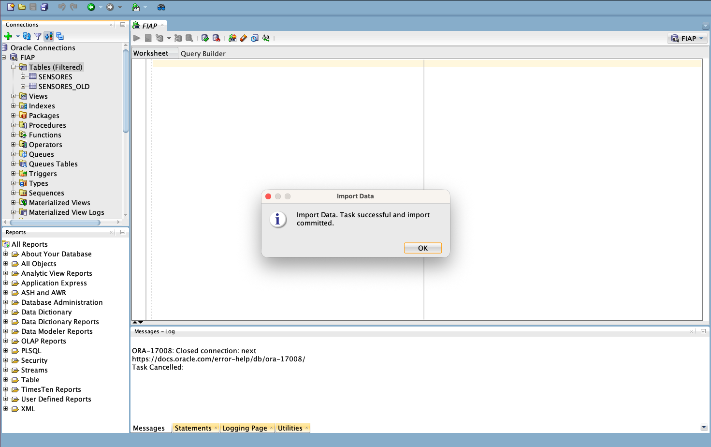
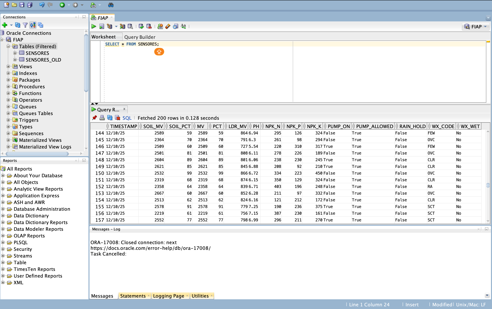

# FIAP - Faculdade de Informática e Administração Paulista 

  

---
# Oracle Data Analysis — FIAP

## Visão Geral

O Oracle Data Analysis é um projeto desenvolvido para demonstrar o processo completo de criação, importação e análise de dados de sensores em um banco de dados Oracle.
O objetivo é proporcionar uma visão prática do fluxo ETL (Extract, Transform, Load) utilizando dados coletados de sensores IoT (como umidade do solo, pH, luminosidade e nutrientes NPK) e aplicando técnicas de análise dentro do ambiente Oracle.

Este projeto foi desenvolvido como parte das atividades da disciplina de Banco de Dados e Análise de Dados da FIAP.

## Time

  
  
  
  
  
  

## Passos para Executar da atividade
<!-- descreva e liste todos os passos da img-1.png até a img-8.png em assets/images -->

## Acesse o Oracle Cloud e crie uma instância de banco de dados Oracle Autonomous Database.

## Faça o upload dos arquivos CSV com os dados dos sensores para o Oracle Cloud Storage.

## Crie uma tabela no banco de dados Oracle para armazenar os dados dos sensores.

## Importa a estrutura da tabela a ser criada.

  

## Seleciona as colunas da tabela a serem criadas.

## Edita as colunas da tabela.

## Finaliza a importação dos dados dos sensores para a tabela criada no banco de dados Oracle.

## Execute consultas SQL para analisar os dados importados.

## Licença

Este projeto está licenciado sob a Licença Creative Commons Atribuição 4.0 Internacional. Para mais detalhes, consulte o arquivo [LICENSE](LICENSE).
